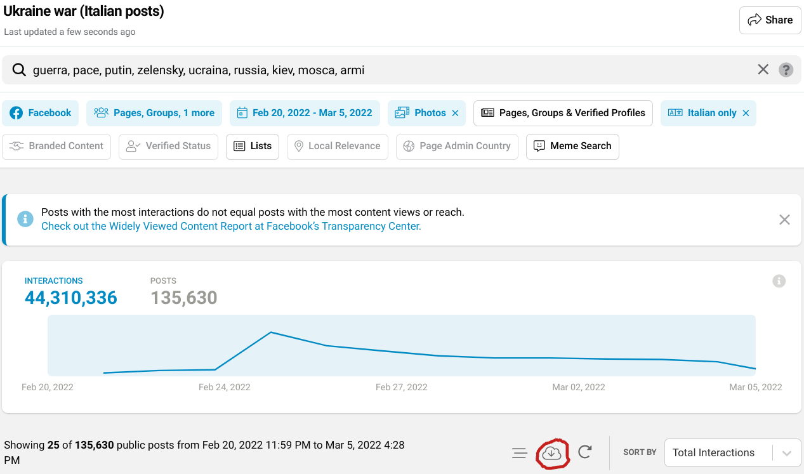

# CooRnet_ImgTxt

Simple r scripts that reuse some [CooRnet](https://coornet.org/) code and logic to detect the coordinated network of Facebook or Instagram accounts that repeatedly share images with identical text in a short period of time.

Given a link to a CSV returned by a [CrowdTangle Search](https://help.crowdtangle.com/en/articles/3873721-crowdtangle-search-faq) export and a coordination interval, returns a list that include a dataframe of coordinated accounts, a graphml file that can be opened and visualized in Gephi and a variable q that represents the threshold number of rapid-shares repetition used to label coordinated accounts.

## Rationale

While Facebook provides the link type post to share links, many users started long ago to share their links in the message of image posts as these type of posts tend to perform better than links ones. This is not an issue for CooRnet as CrowdTangle recognizes links shared in such a way and strips the links from the message text.

However, our most recent analysis pointed out the emergence of a relatively new strategy used by coordinated link sharing networks to avoid being detected as such. The link is not anymore shared in the post itself but in the first comment of an image post. The image itself often contains a click-bait text and the message includes a pointing down arrow emoji to the link in the comment.

Given the fact that CrowdTangle do not provide access to the comments, CLSB networks adopting this strategy can't be detected by CooRnet.

We first described this behavior in

Giglietto, Fabio and Terenzi, Massimo and Marino, Giada and Marino, Giada and Righetti, Nicola and Rossi, Luca, Adapting to Mitigation Efforts: Evolving Strategies of Coordinated Link Sharing on Facebook (December 29, 2020). Available at SSRN: <https://ssrn.com/abstract=3775469> or <http://dx.doi.org/10.2139/ssrn.3775469>.

CooRnet_ImgTxt address this limit by looking at accounts that share images with the same text in a very short period of time and repeatedly.

## Usage

Open [CrowdTangle Search](https://help.crowdtangle.com/en/articles/3873721-crowdtangle-search-faq) and perform your desired Facebook or Instagram query and export your results by clicking the download button (make sure to keep the default comma CSV delimiter).

You can export up to 300k posts, but the scripts allow combining multiple CSV files. If your query exceeds the 300k posts you can split it in multiple queries.

In a few minutes (the waiting time depends on the number of posts you requested), you will receive a message in your inbox with a link to the CSV of your query just created for you.

Copy the link to the CSV file (you may also want to download it as the file won't be permanently stored). Paste the link in the script. Please use [blueapp.r](https://github.com/fabiogiglietto/CooRnet_ImgTxt/blob/main/blueapp.R) for a Facebook search or [rainbowapp.r](https://github.com/fabiogiglietto/CooRnet_ImgTxt/blob/main/rainbowapp.R) for an Instagram search.

You may want to customize the coordination_interval (time in second between the share of the same image to label it as a rapid share) and the percentile_edge_weight (in a nutshell is the quantile used to cut the network by including only accounts that performed rapid share of the same images repetedly) parameter to fine-tune your results.

Run the script and wait patiently that the progress bar reaches 100%. Ones finished, your Environment should resemble something like this:

The script detected 284 coordinated accounts that shared an image with the same text within a period of 60 seconds (coordination interval) at least 11 times (see the value of q variable).

You can inspect the image_text most frequently repeated by taking a look to the unique_imageText dataframe and sorting by ct_shares.

If you lookup one of the imageText in CrowdTangle Search (don't forget to enable Meme Search) and sort posts by time you should start to see the accounts in your networks.

The scripts also created two output files in your working directory: highly_connected_coordinated_entities.csv (view with Excel or Google Sheet) and highly_connected_g.graphml (import in Gephi or similar SNA tools).

By inspecting the network visualization and the accounts listed in CSV (note the component and cluster column in the table) you can annotate your map of coordinated accounts.

## Future works

Whenever I have time, I plan to improve this project as follows:

1.  Merge the two scripts to analyze cross-platform coordinated networks;

2.  Port the script to a function and release it as a package;

3.  Port some other functions from CooRnet (e.g. get_clusters/components for an overview of detected networks and most frequently associated imgtxt).

Help on this (or other) tasks is very well welcome!

If you have spare time and want to contribute just drop me a message!
